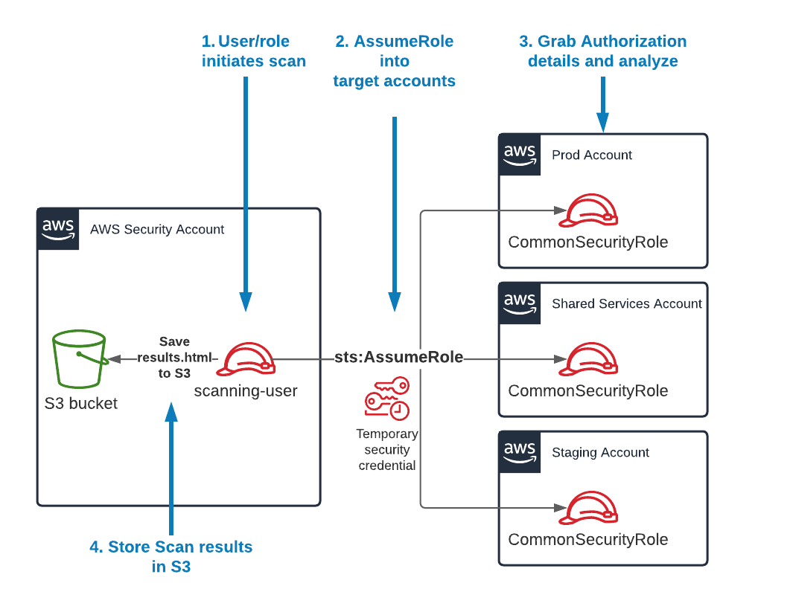

# Scanning Multiple Accounts at once

If your IAM user or IAM role has `sts:AssumeRole` permissions to a common IAM role across multiple AWS accounts, you can use the `scan-multi-account` command.

This diagram depicts how the process works:



!!! note Setting up cross-account trust
    If you are new to setting up cross-account access, check out [the official AWS Tutorial on Delegating access across AWS accounts using IAM roles](https://docs.aws.amazon.com/IAM/latest/UserGuide/tutorial_cross-account-with-roles.html). That can help you set up the architecture above.

* First, you'll need to create the multi-account config file. Run the following command:

```bash
cloudsplaining create-multi-account-config-file \ 
    -o multi-account-config.yml
```

* This will generate a file called `multi-account-config.yml` with the following contents:

```yaml
accounts:
  default_account: 123456789012
  prod: 123456789013
  test: 123456789014
```

!!! note 
    Observe how the format of the file above includes `account_name: accountID`. Edit the file contents to match your desired account name and account ID. Include as many account IDs as you like.


For the next step, let's say that:

* We have a role in the target accounts that is called `CommonSecurityRole`. 
* The credentials for your IAM user are under the AWS Credentials profile called `scanning-user`.
* That user has `sts:AssumeRole` permissions to assume the `CommonSecurityRole` in all your target accounts specified in the YAML file we created previously.
* You want to save the output to an S3 bucket called `my-results-bucket`

Using the data above, you can run the following command:

```bash
cloudsplaining scan-multi-account \
    -c multi-account-config.yml \
    --profile scanning-user \
    --role-name CommonSecurityRole \ 
    --output-bucket my-results-bucket
```

!!! note Using the --profile flag
    Note that if you run the above without the `--profile` flag, it will execute in the standard [AWS Credentials order of precedence](https://docs.aws.amazon.com/sdk-for-java/v1/developer-guide/credentials.html#credentials-default) (i.e., Environment variables, credentials profiles, ECS container credentials, then finally EC2 Instance Profile credentials). 

